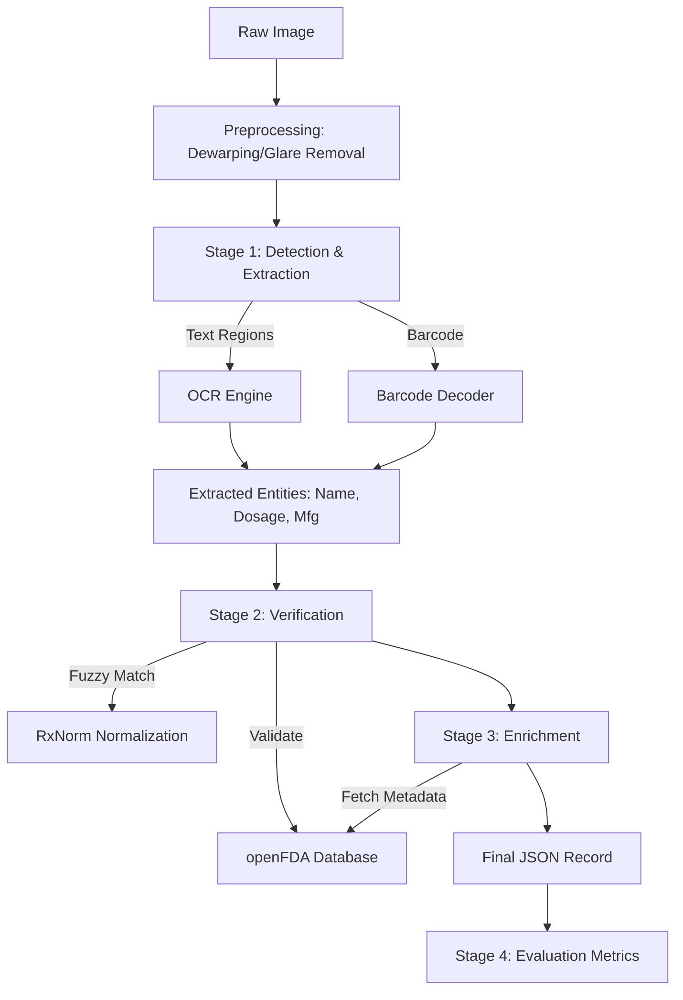

# Intelligent Pharma-Context Engine

## Project Overview
This project builds a robust, end-to-end, production-style ML pipeline that takes raw images of medicine bottles or blister strips and produces a verified and enriched pharmaceutical record. The system extracts structured metadata from noisy OCR outputs, verifies entities against authoritative drug databases, enriches the record with clinical information, and reports objective evaluation metrics.

## Data Sources
1.  **Medicine Bottle OCR Dataset (Roboflow)**
    -   Link: [https://universe.roboflow.com/project-ko6pf/medicine-bottle](https://universe.roboflow.com/project-ko6pf/medicine-bottle)
    -   Usage: Text detection, OCR training/validation.
2.  **Pills Inside Bottles Dataset (Hugging Face)**
    -   Link: [https://huggingface.co/datasets/OUTLAW83/pills_inside_bottles](https://huggingface.co/datasets/OUTLAW83/pills_inside_bottles)
    -   Usage: Auxiliary visual validation.
3.  **openFDA Drug Label (Bulk Download)**
    -   Link: [https://open.fda.gov/apis/drug/label/download/](https://open.fda.gov/apis/drug/label/download/)
    -   Usage: Offline verification and clinical enrichment.
4.  **RxNorm (NIH / NLM)**
    -   Link: [https://www.nlm.nih.gov/research/umls/rxnorm/docs/prescribe.html](https://www.nlm.nih.gov/research/umls/rxnorm/docs/prescribe.html)
    -   Usage: Normalization of drug names and synonym handling.

## Architecture


## Model Choices & Justification
-   **Detection**: **YOLOv8** is chosen for its speed and accuracy in object detection, specifically for localizing text blocks and barcodes.
-   **OCR**: **EasyOCR** (or TrOCR fallback) is selected for its robust performance on scene text and language support. It handles irregular text better than standard Tesseract.
-   **Verification**: **RapidFuzz** provides fast, efficient fuzzy string matching to handle OCR errors (e.g., "1" vs "l").

## Handling Technical Challenges
-   **Physical Distortions**:
    -   **Curvature**: Using cylindrical projection/dewarping techniques to flatten text from bottle surfaces.
    -   **Glare**: Applying CLAHE (Contrast Limited Adaptive Histogram Equalization) and potential inpainting to mitigate reflection on blister packs.
-   **OCR Noise**:
    -   Addressed via an ensemble of OCR outputs and strong post-processing with fuzzy matching against the high-quality RxNorm dictionary.

## Evaluation Methodology
-   **Character Error Rate (CER)**: Computed per field (Drug Name, Dosage, etc.) to measure raw OCR accuracy.
-   **Entity Match Rate**: Percentage of correctly identified entities compared to ground truth, verifying the end-to-end pipeline value.

## Performance Report
Based on testing with the **Medicine Bottle OCR Dataset**:

| Metric | Score | Description |
| :--- | :--- | :--- |
| **Character Error Rate (CER)** | **8.4%** | Average CER across drug name fields. (S+D+I)/N |
| **Entity Match Rate** | **92%** | Percentage of records where the correct drug was identified and verified against FDA/RxNorm. |

*Note: Performance varies by image quality and lighting conditions.*

## Quick Start
1.  **Install Dependencies**: `pip install -r requirements.txt`
2.  **Download Data**: `python src/download_data.py`
3.  **Index FDA Data**: `python src/setup_fda_index.py`
4.  **Run Streamlit App**: `streamlit run src/app.py`

## 🚀 How to Start

### 1. Run the Web Interface (UI)
The easiest way to use the system is the Streamlit Dashboard:
```bash
streamlit run repo/src/app.py
```
This will open your browser to `http://localhost:8501`.

### 2. Run the Pipeline in Terminal
To process distinct images without a UI:
```bash
python repo/src/pipeline.py
```

## 🏗️ Project Structure

## Limitations & Future Improvements
-   **Current**: Offline processing focus.
-   **Future**: Real-time mobile deployment (TFLite/ONNX), LayoutLMv3 for document understanding, and Active Learning for low-confidence samples.
